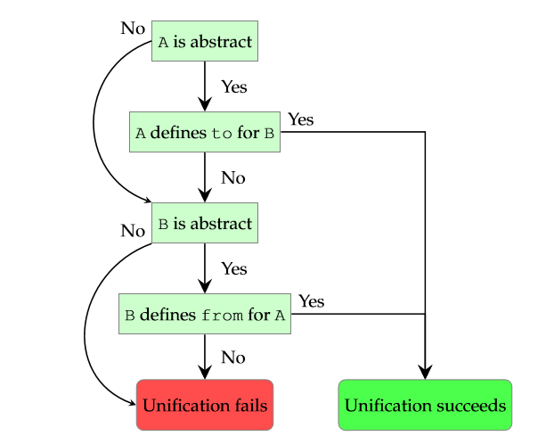

# 2.8.抽象类型

一个抽象类型在运行时实际上是一个不同的类型。它是一个编译时功能，在固有类型之上定义来修改或者增强它们的行为的类型：

```haxe
abstract AbstractInt(Int) {
    inline public function new(i:Int) {
        this = i; 
    } 
} 
```

从这个例子我们可以得出以下几点 ：

- 关键字 `abstract` 表示我们声明一个抽象类型
- `AbstractInt` 是抽象类型的名称，可以是任何符合类型标识符规则的字符
- 圆括号 `()` 中的是潜在的类型 Int
- 大括号 `{}` 中的是字段
- 构造函数 `new` 接受一个 Int 类型的参数 `i`

**潜在类型**

> **定义**：潜在类型
>  抽象类型的潜在类型是用来代表抽象类型在运行时的类型。通常是一个具体的（即非抽象的）类型，但是也可以是另一个抽象类型。

这个语法让人联想到类，语义上它们事实的确非常相似。实际上，每个在抽象类型“体”中的（即所有花括号之后的一切）都被解析为类字段。抽象类型可以有 [方法（第4.3节）](http:///#) 字段和 [非物理（第4.2.3节）](http:///#)[属性（第4.2节）](http:///#) 字段。此外，抽象类型可以被像类一样实例化和使用：

```haxe
class Main { 
    static public function main() { 
        var a = new AbstractInt(12);
        trace(a); //12 
    } 
} 
```

如前所述，抽象类型是一个编译时功能，所以看看上面示例实际生成的内容会很有趣。一个合适的目标是 JavaScript，它往往可以生成简洁干净的代码。编译上面的代码（使用 `haxe -main MyAbstract -js myabstract.js`）会显示如下 JavaScript 代码：

```haxe
var a = 12; 
console.log(a);
```

抽象类型 `Abstract` 在输出中完全消失了，剩下的只是一个它潜在类型的值，Int。因为 `Abstract` 的构造函数是内联的 （在 [内联部分（第4.4.2节）](http:///#) 我们将进行学习的内容 ） ，它的内联表达式分配一个值到这里。当以类进行思考的话，这可能是令人惊讶的。然而，这恰巧是我们希望在抽象类型的上下文中表达的。抽象类型的任何内联成员方法都可以分配到这里，从而修改 “内部的值”。在这点上，一个好的问题是 “如果一个成员函数没有被内联声明将发生什么”，因为代码显然必须放到某个地方。Haxe 创建一个私有类，即已知的实现类，它将所有的抽象成员函数作为接受一个附加的类型为潜在类型的首参数的静态函数。虽然技术上上这是一个实现细节，但它可以被用于 [选择函数（第2.8.4节）](http:///#)。

> **花絮**：基本类型和抽象类型
> 在抽象类型到来之前，所有基本类型都实现为外部类或者枚举。虽然这很好的考虑了某些方面，如 Int 是 Float 的一个“子类”，但这也在别处引起问题。例如，通过 Float 作为一个外部类，它会和空的结构 `{}` 统一，使得不可能限制一个类型只接受真正的对象。


------


An abstract type is a type which is actually a different type at run-time. It is a compile-time feature which defines types "over" concrete types in order to modify or augment their behavior:

```haxe
abstract AbstractInt(Int) {
  inline public function new(i:Int) {
    this = i;
  }
}
```

We can derive the following from this example:

- The keyword `abstract` denotes that we are declaring an abstract type.
- `AbstractInt` is the name of the abstract type and could be anything conforming to the rules for type identifiers.
- The **underlying type** `Int` is enclosed in parentheses `()`.
- The fields are enclosed in curly braces `{}`,
- which are a constructor function `new` accepting one argument `i` of type `Int`.

> ##### [Define: Underlying Type](https://haxe.org/manual/types-abstract.html#define-underlying-type)
>
> The underlying type of an abstract is the type which is used to represent said abstract at runtime. It is usually a concrete (i.e. non-abstract) type but could be another abstract type as well.

The syntax is reminiscent of classes and the semantics are indeed similar. In fact, everything in the "body" of an abstract (everything after the opening curly brace) is parsed as class fields. Abstracts may have [method](https://haxe.org/manual/class-field-method.html) fields and non-[physical](https://haxe.org/manual/class-field-property-rules.html#define-physical-field) [property](https://haxe.org/manual/class-field-property.html) fields.

Furthermore, abstracts can be instantiated and used just like classes:

```haxe
class Main {
  static public function main() {
    var a = new AbstractInt(12);
    trace(a); // 12
  }
}
```

As mentioned before, abstracts are a compile-time feature, so it is interesting to see what the above actually generates. A suitable target for this is JavaScript, which tends to generate concise and clean code. Compiling the above using `haxe --main MyAbstract --js myabstract.js` shows this JavaScript code:

```haxe
var a = 12;
console.log(a);
```

The abstract type `Abstract` completely disappeared from the output and all that is left is a value of its underlying type, `Int`. This is because the constructor of `Abstract` is inlined - something we shall learn about later in the section [Inline](https://haxe.org/manual/class-field-inline.html) - and its inlined expression assigns a value to `this`. This might be surprising when thinking in terms of classes. However, it is precisely what we want to express in the context of abstracts. Any **inlined member method** of an abstract can assign to `this` and thus modify the "internal value".

One problem may be apparent - what happens if a member function is not declared inline? The code obviously must be placed somewhere! Haxe handles this by creating a private class, known as the **implementation class**, which contains all the abstract member functions as static functions accepting an additional first argument `this` of the underlying type.

> ##### [Trivia: Basic Types and abstracts](https://haxe.org/manual/types-abstract.html#trivia-basic-types-and-abstracts)
>
> Before the advent of abstract types, all basic types were implemented as extern classes or enums. While this nicely took care of some aspects such as `Int` being a "child class" of `Float`, it caused issues elsewhere. For instance, with `Float` being an extern class, it would unify with the empty structure `{}`, making it impossible to constrain a type to accept only real objects.


# 2.8.1.隐式类型转换

与类不同，抽象类型允许定义隐式转换。有两种类型的隐式转换：

**直接转换：** 允许抽象类型和其它类型之间的直接转换。这通过从或者往抽象类型添加规则来定义，而且只允许用于和抽象类型的潜在类型统一的类型。

**类字段：** 允许通过调用特别的转换函数进行转换。这些函数通过使用 `@:to` 和 `@:from` 元数据定义。这种类型的转换允许用于所有类型。

如下的代码示例展示直接转换的一个例子：

```haxe
abstract MyAbstract(Int) from Int to Int { 
    inline function new(i:Int) {
        this = i; 
    } 
} 

class Main {
    static public function main() {
        var a:MyAbstract = 12; 
        var b:Int = a; 
    }
} 
```

我们声明 `MyAbstract` 可以是从或者到 Int 类型，意思是它可以被用 Int 分配，并且可以分配到 Int 类型。这在第9和10行展示，第一个分配 Int `12` 到 `MyAbstract` 类型的变量 `a`（通过使用 `from Int` 声明 ），然后这个抽象类型分配回 Int 类型变量 `b`（通过使用 `to Int` 声明）。

另一种的类字段转换有相同的语义，但是定义完全不同：

```haxe
abstract MyAbstract(Int) { 
    inline function new(i:Int) {
        this = i;
    }
    @:from 
    static public function fromString(s:String) {
        return new MyAbstract(Std.parseInt(s)); 
    } 
    
    @:to 
    public function toArray() { 
        return [this]; 
    } 
} 

class Main { 
    static public function main() { 
        var a:MyAbstract = "3"; 
        var b:Array<Int> = a; 
        trace(b); // [3] 
    }
}
```

通过添加 `@:from` 到一个静态函数，这个函数获得资格作为从它的参数类型到抽象类型的隐式转换函数。这些函数必须返回一个抽象类型的值。它们还必须被声明为静态的 ：

类似的，添加 `@:to` 到一个函数，它获取资格作为从抽象类型到它的返回类型的隐式转换函数。这些函数通常是成员函数，但是它们可以被声明为静态 ，然后作为一个 [选择函数（第2.8.4节）](http:/#)。

在例子中，方法 `fromString` 允许分配值 “`3`” 到 `MyAbstract` 类型的变量 `a`，而方法 `toArray` 允许分配抽象类型到 `Array` 类型的变量 `b`。

当使用这种类型的转换，转换函数的调用被插入在需要的地方。当查看 JavaScript 输出的时候会很明显：

```haxe
var a = _ImplicitCastField.MyAbstract_Impl_.fromString("3"); 
var b = _ImplicitCastField.MyAbstract_Impl_.toArray(a); 
```

这可以被进一步优化，通过 [内联（第4.4.2节）](http:/#) 两种转换函数，使得输出如下：

```haxe
var a = Std.parseInt("3"); 
var b = [a]; 
```

当分配一个类型 A 到一个类型 B，并且至少它们中的一个为抽象类型时，选择的规则很简单：

- 1.如果 A 不是一个抽象类型，去到 3
- 2.如果 A 定义了一个允许到 B 的 `to` 转换，去到6
- 3.如果 B 不是一个抽象类型，去到 5
- 4.如果 B 定义一个允许到 A 的 `from` 转换，去到6
- 5.停止，统一失败
- 6.停止，统一成功



经过设计，隐式转换不被传递，就像下面的例子展示的：

```haxe
abstract A(Int) { 
    public function new() this = 0; 
    @:to public function toB() return new B(); 
} 

abstract B(Int) {
    public function new() this = 0; 
    @:to public function toC() return new C(); 
}

abstract C(Int) { 
    public function new() this = 0; 
} 

class Main { 
    static public function main() { 
        var a = new A(); 
        var b:B = a; // valid, uses A.toB 
        var c:C = b; // valid, uses B.toC 
        var c:C = a; // error, A should be C 
    } 
} 
```

虽然从 A 到 B 的转换和从 B 到 C 的转换分别是允许的，而一个传递的从 A 到 C 的转换则不允许。这是为了避免不明确的转换路径，并保持一个简单的选择规则。


------


Unlike classes, abstracts allow defining implicit casts. There are two kinds of implicit casts:

- Direct: Allows direct casting of the abstract type to or from another type. This is defined by adding `to` and `from` rules to the abstract type and is only allowed for types which unify with the underlying type of the abstract.
- Class field: Allows casting via calls to special cast functions. These functions are defined using `@:to` and `@:from` metadata. This kind of cast is allowed for all types.

The following code example shows an example of **direct** casting:

```haxe
abstract MyAbstract(Int) from Int to Int {
  inline function new(i:Int) {
    this = i;
  }
}

class Main {
  static public function main() {
    var a:MyAbstract = 12;
    var b:Int = a;
  }
}
```

We declare `MyAbstract` as being `from Int` and `to Int`, appropriately meaning it can be assigned from `Int` and assigned to `Int`. This is shown in lines 9 and 10, where we first assign the `Int` `12` to variable `a` of type `MyAbstract` (this works due to the `from Int` declaration) and then that abstract back to variable `b` of type `Int` (this works due to the `to Int` declaration).

Class field casts have the same semantics, but are defined completely differently:

```haxe
abstract MyAbstract(Int) {
  inline function new(i:Int) {
    this = i;
  }

  @:from
  static public function fromString(s:String) {
    return new MyAbstract(Std.parseInt(s));
  }

  @:to
  public function toArray() {
    return [this];
  }
}

class Main {
  static public function main() {
    var a:MyAbstract = "3";
    var b:Array<Int> = a;
    trace(b); // [3]
  }
}
```

By adding `@:from` to a static function, that function qualifies as an implicit cast function from its argument type to the abstract. These functions must return a value of the abstract type. They must also be declared `static`.

Similarly, adding `@:to` to a function qualifies it as implicit cast function from the abstract to its return type.

In the previous example, the method `fromString` allows the assignment of value `"3"` to variable `a` of type `MyAbstract` while the method `toArray` allows assigning that abstract to variable `b` of type `Array<Int>`.

When using this kind of cast, calls to the cast functions are inserted where required. This becomes obvious when looking at the JavaScript output:

```haxe
var a = _ImplicitCastField.MyAbstract_Impl_.fromString("3");
var b = _ImplicitCastField.MyAbstract_Impl_.toArray(a);
```

This can be further optimized by [inlining](https://haxe.org/manual/class-field-inline.html) both cast functions, turning the output into the following:

```haxe
var a = Std.parseInt("3");
var b = [a];
```

The **selection algorithm** when assigning a type `A` to a type `B` where at least one is an abstract is simple:

1. If `A` is not an abstract, go to 3.
2. If `A` defines a **to**-conversion that admits `B`, go to 6.
3. If `B` is not an abstract, go to 5.
4. If `B` defines a **from**-conversion that admits `A`, go to 6.
5. Stop, unification fails.
6. Stop, unification succeeds.


By design, implicit casts are **not transitive**, as the following example shows:

```haxe
abstract A(Int) {
  public function new()
    this = 0;

  @:to public function toB() return new B();
}

abstract B(Int) {
  public function new()
    this = 0;

  @:to public function toC() return new C();
}

abstract C(Int) {
  public function new()
    this = 0;
}

class Main {
  static public function main() {
    var a = new A();
    var b:B = a; // valid, uses A.toB
    var c:C = b; // valid, uses B.toC
    var c:C = a; // error, A should be C
  }
}
```

While the individual casts from `A` to `B` and from `B` to `C` are allowed, a transitive cast from `A` to `C` is not. This is to avoid ambiguous cast paths and retain a simple selection algorithm.


# 2.8.2.运算符重载

抽象类型通过添加 `@:op` 元数据到类字段，允许一元和二元运算符的重载：

```haxe
abstract MyAbstract(String) { 
    public inline function new(s:String) { 
        this = s; 
    } 
    
    @:op(A * B) 
    public function repeat(rhs:Int):MyAbstract { 
        var s:StringBuf = new StringBuf(); 
        for (i in 0...rhs) 
        s.add(this); 
        return new MyAbstract(s.toString()); 
    } 
} 

class Main { 
    static public function main() { 
        var a = new MyAbstract("foo"); 
        trace(a * 3); // foofoofoo 
    }
} 
```

通过默认的 `@:op(A*B)`，当左面的值类型是 `MyAbstract` 而且右侧值是 Int 类型的时候，函数 `repeat` 作为乘法 `*` 运算符的运算符。用法在第17行显示，编译到 JavaScript 之后代码成为这样：

```haxe
console.log(_AbstractOperatorOverload.MyAbstract_Impl_.repeat(a,3));
```

类似于通过 [类字段（第2.8.1）](http://#) 方式隐式转换，重载之后的方法的调用被插入到需要的地方。

示例中的 `repeat` 函数是不可交换的：当 `MyAbstract * Int` 工作，`Int * MyAbstract` 则不工作。如果这应该同时允许，可以添加`@:commutative` 元数据。如果它只可以为 `Int * MyAbstract` 工作，而不是为 `MyAbstract * Int`，重载方法可以被设置为 `static`，接受 Int 和 MyAbstract 分别作为第一个和第二个类型。

重载一元运算符是相似的：

```haxe
abstract MyAbstract(String) {
    public inline function new(s:String) { 
        this = s; 
    }
    
    @:op(++A) public function pre() 
        return "pre" + this; 
    @:op(A++) public function post()
        return this + "post"; 
}

class Main { 
    static public function main() {
        var a = new MyAbstract("foo");
        trace(++a); // prefoo 
        trace(a++); // foopost
    } 
} 
```

二元运算和一元运算符重载都可以返回任何类型。

**暴露潜在类型的操作** 还可以省略 `@:op` 函数的方法体，但是只有抽象类型的潜在类型允许涉及的操作，并且结果类型可以被赋值回抽象类型的时候。

```haxe
abstract MyAbstractInt(Int) from Int to Int { 
    // 下面一行从潜在类型Int暴露 （A>B）操作符
    // 注意，并没有使用函数体 
    @:op(A > B) static function gt( a:MyAbstractInt, b:MyAbstractInt ) : Bool; 
}

class Main { 
    static function main() { 
        var a:MyAbstractInt = 42; 
        if(a > 0) trace(’Works fine, > operation implemented!’); 
        
        // 小于操作符没有实现
        // 这会引起一个 “不能对比MyAbstractInt 和 Int”的错误:
        if(a < 100) { } 
    }
}
```


# 2.8.3.数组访问

数组访问描述了特定的语法，传统上用于访问数组中的某个偏移量的值。通常只允许带有 Int 类型的参数。然而，使用抽象类型也可以定义自己的数组访问方法。[Haxe 标准库（第10章）](http:///#) 通过它的 Map 类型应用这种方式，其中下面两个方法可以被发现：

```haxe
@:arrayAccess 
public inline function get(key:K) {
    return this.get(key); 
}

@:arrayAccess 
public inline function arrayWrite(k:K, v:V):V { 
    this.set(k, v); 
    return v; 
} 
```

有两种数组访问方法：

- 如果一个 `@:arrayAccess` 方法接受一个参数，它是一个 `getter`；
- 如果一个 `@:arrayAccess` 方法接受两个参数，它是一个 `setter`。

然后下面看到的 `get` 和 `arrayWrite` 方法允许这样使用：

```haxe
class Main { 
    public static function main() { 
        var map = new Map(); 
        map["foo"] = 1; 
        trace(map["foo"]); 
    }
} 
```

在这一点上，看到数组访问字段的调用被插入到输入内容应该不会太让人吃惊：

```haxe
 map.set("foo",1); 
 console.log(map.get("foo")); // 1
```

**数组访问解析的顺序**
 由于Haxe 3.2 版本之前的一个 bug，检查 `:arrayAccess` 字段的顺序是未被定义的。在 3.2 版本中已经修复所以现在总是从上到下进行检查字段：

```haxe
abstract AString(String) { 
    public function new(s) this = s;
    @:arrayAccess function getInt1(k:Int) {
        return this.charAt(k); 
    } 
    @:arrayAccess function getInt2(k:Int) { 
        return this.charAt(k).toUpperCase();
    }
}

class Main { 
    static function main() {
        var a = new AString("foo"); 
        trace(a[0]); // f 
    }
} 
```

数组访问 `a[0]` 被解析到 `getInt1` 字段，使得小写的 `f` 被返回。结果可能和 Haxe 3.2 之前的版本不同。

先定义的字段有优先级，即使它们需要一个[ 隐式的转换（第2.8.1节）](http:///#)。


# 2.8.4.选择函数

由于编译器提升抽象成员函数为静态函数，可以手动定义静态函数并使用它们到一个抽象类的实例。这里的语法和那些第一个函数参数类型决定函数被定义为什么类型的 [静态扩展（第6.3节）](http:///#) 类似，：

```haxe
abstract MyAbstract<T>(T) from T {
    public function new(t:T) this = t; 
    
    function get() return this;
    @:impl 
    static public function getString(v:MyAbstract<String>):String { 
        return v.get(); 
    }
} 

class Main { 
    static public function main() { 
        var a = new MyAbstract("foo");
        a.getString(); 
        var b = new MyAbstract(1); 
        // Int should be MyAbstract<String> 
        b.getString();
    }
} 
```

抽象类型 `MyAbstract` 的方法 `getString` 被定义为接受一个 `MyAbstract` 类型首参数。这使它在第14行可以用在变量 `a` 上（因为 `a` 的类型为 `MyAbstract`），但是不能用在变量 `b` 上，`b` 的类型是 `MyAbstract` 。

> **花絮**：意外的功能
> 选择函数是被发现的，而不是真的设计了它的用法。在第一次提到这个想法后，只需要编译器中的一点调整就可以使它们工作。它们的这些发现还引入了多类型抽象类型，比如 Map 。


# 2.8.5.枚举抽象类型

**Haxe 3.0版本之后**

通过添加 `:enum` 元数据到一个抽象类型的定义，这个抽象类可以被用来定义有限值的集合：

```haxe
@:enum 
abstract HttpStatus(Int) { 
    var NotFound = 404; 
    var MethodNotAllowed = 405; 
}

class Main { 
    static public function main() { 
        var status = HttpStatus.NotFound; 
        var msg = printStatus(status); 
    } 
    
    static function printStatus(status:HttpStatus) { 
        return switch(status) {
            case NotFound: 
                "Not found"; 
            case MethodNotAllowed: 
                "Method not allowed";
        } 
    } 
} 
```

Haxe 编译器使用它们的值替换所有的字段访问到 `HttpStatus` 抽象类型，在 JavaScript 的输出则很明显：

```haxe
 Main.main = function() { 
    var status = 404;
    var msg = Main.printStatus(status);
};
Main.printStatus = function(status) { 
    switch(status) {
        case 404:
            return "Not found"; 
        case 405:
            return "Method not allowed"; 
    }
};
```

这和访问 [内联（第4.4.2节）](http:///#) 声明的变量很相似，但是有几个优点：

- 类型工具可以确保集合的所有值会被正确分配类型。
- 匹配模式在 [匹配（第6.4节）](http:///#) 一个枚举抽象类型时检查其 [穷尽性（第6.4.10节）](http:///#)。
- 用更少的语句定义字段。


# 2.8.6.转发抽象类型字段

**Haxe 3.0版本之后**

当包装一个潜在类型，有时候需要保持部分它的功能。因为手工编写转发函数非常繁琐，Haxe 允许添加 `:forward` 元数据到一个抽象类型：

```haxe
 @:forward(push, pop) 
 abstract MyArray<S>(Array<S>) {
    public inline function new() { 
        this = []; 
    } 
}

class Main { 
    static public function main() { 
        var myArray = new MyArray();
        myArray.push(12); 
        myArray.pop(); 
        // MyArray<Int> has no field length 
        //myArray.length; 
    }
}
```

这个例子中的 `MyArray` 抽象类封装了 Array。它的 `:forward` 元数据有两个参数，对应要被转发到潜在类型的字段名。在这个例子中，`main` 方法实例化 `MyArray` 并访问它的 `push` 和 `pop` 方法。注释行表明 `length` 字段是不可用的。

像往常一样我们可以查看 JavaScript 输出来看一下代码如何生成：

```haxe
 Main.main = function() { 
    var myArray = []; 
    myArray.push(12); 
    myArray.pop(); 
}; 
```

也可以使用 `:forward` 而不带任何参数，来转发所有字段。当然 Haxe 编译器仍然保证字段实际上存在于潜在类型。

> **花絮**：实现为宏
> `:enum` 和 `:forward` 功能都是最初被使用 [构建宏（第9.5节）](http:///#) 实现的。虽然这可以在非宏代码很好的运行，但是如果这些功能从宏内部运行它会引起问题。这个实现后来被移到编译器中。


# 2.8.7.核心类型抽象

Haxe 标准库定义了一组基础类型作为核心类型抽象。它们通过 `:coreType` 元数据识别，而且缺失一个潜在类型的声明。这些抽象类型仍然可以被理解为表示不同的类型。不过，这个类型是 Haxe 目标语言原生的。

引入自定义核心类型抽象在用户代码中是很有必要的，因为它需要 Haxe 目标语言可以理解它的意思。然而，对于宏的作者和新的 Haxe 目标语言可能是很有趣的用例。

与难懂的抽象类型的相比，核心类型抽象有下面的属性：

- 它们没有潜在类型。
- 它们被认为是可空的，除非带有 `:notNull` 元数据的注解。
- 它们被允许没有表达式形式的 [数组访问（第2.8.3节）](http:///#) 函数声明。
- 没有表达式的 [运算符重载字段（第2.8.2节）](http:///#) 不会被强制追随 Haxe 的类型语法形式。