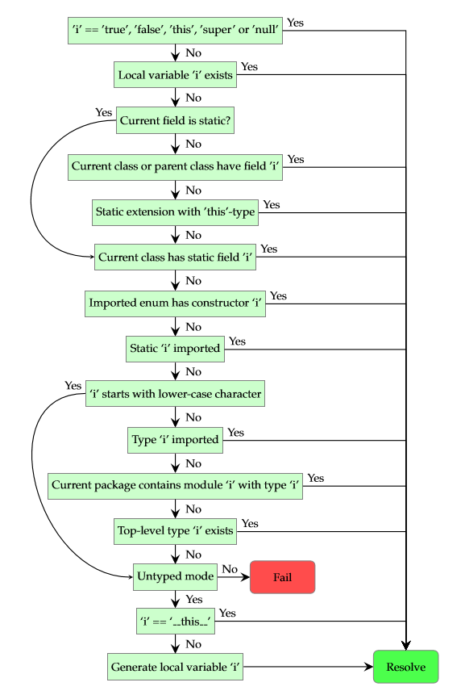

# 3.7.模块和路径

> **定义**：模块
>  所有的Haxe代码组织在模块中，通过路径定位。本质上讲，每个.hx 文件表示一个模块，其中可能包含多个类型，其中的类型可能是修饰为 `private` 的私有类，这种情况下只有在它所处的模块之内才能访问到它。
>  [warning] Definition: Module
>  All Haxe code is organized in modules, which are addressed using paths. In essence, each .hx file represents a module which may contain several types. A type may be private, in which case only its containing module can access it.

模块和它所包含的同名类型之间的区别在设计上是模糊的。事实上，定位 `haxe.ds.StringMap<Int>` 可以认为是 `haxe.ds.StringMap.StringMap<Int>` 的简短写法。后者由四部分构成：

*The distinction between a module and its containing type of the same name is blurry by design. In fact, addressing `haxe.ds.StringMap<Int>` can be considered shorthand for `haxe.ds.StringMap.StringMap<Int>`. The latter version consists of four parts:*

1. 包名 `haxe.ds`
2. 模块名 `StringMap`
3. 类型名 `StringMap`
4. 类型参数 `Int`

如果模块和类型名是相同的，重复的部分可以被省略，使用 `haxe.ds.StringMap<Int>` 作为速记。然而，了解扩展的记法可以帮助我们理解 [模块子类型（3.7.1）]()是如何定位的。

*If the module and type name are equal, the duplicate can be removed, leading to the `haxe.ds.StringMap<Int>` short version. However, knowing about the extended version helps with understanding how [module sub-types](https://haxe.org/manual/type-system-module-sub-types.html) are addressed.*

路径可以通过使用 import 进一步简化，这么做通常可以省略路径中包名的部分，其中涉及无约束标识符的使用，

*Paths can be shortened further by using an import(3.7.2), which typically allows omitting the package part of a path. This may lead to usage of unqualified identifiers, for which understanding the resolution order (3.7.3) is required.*

> **定义**：类型路径
>  类型的点路径由包，模块名和类型名组成。它的通常格式是 pack1.paceN.ModuleName.TypeName 。
>  [warning] Definition: Type path
>  The (dot-)path to a type consists of the package, the module name and the type name. Its general form is pack1.pack2.packN.ModuleName.TypeName.


# 3.7.1.模块子类型

模块子类型是一个模块中与模块不同名的类型。这使得一个 .hx 文件中可以包含多个类型声明，这些类型可以在该模块中不受限制地被调用，但从其它模块中使用时需通过 `package.Modoule.Type` 的形式进行访问:

*A module sub-type is a type declared in a module with a different name than that module. This allows a single .hx file to contain multiple types, which can be accessed unqualified from within the module, and by using package.Module.Type from other modules:*

```haxe
var e:haxe.macro.Expr.ExprDef; 
```

此处访问了 `haxe.macro.Expr` 模块中的模块子类型 `ExprDef`。

模块子类型的声明可能看起来如下所示：

```haxe
// a/A.hx
package a;

class A { public function new() {} }
// sub-type
class B { public function new() {} }
```

```haxe
// Main.hx
import a.A;
class Main {
    static function main() {
        var subtype1 = new a.A.B();
        
        // these are also valid, but require import a.A or import a.A.B
        var subtype2 = new B();
        var subtype3 = new a.B();
    }
}
```

模块子类型的关系不会反映于运行时；一个修饰为 public 的模块子类型会被认为是其所在的包（package）的一个成员，比如在上面的例子中，模块子类型 `ExprDef` 会被生成为 `haxe.macro.ExprDef`。所以当一个包中存在两个模块，且两个模块中定义了同名的模块子类型时可能会产生冲突。通常，Haxe编译器会侦测到这类情况并做出相应报告。

模块子类型也可以被声明为私有的（private）：

```haxe
private class C {...}
private enum E {...}
private typedef T {...}
private abstract A {...}
```


> **定义：私有类型**
> 一个类型可以通过 `private` 访问修饰符被声明为私有。这会导致这个类型只能从定义它的这个模块内部直接进行访问。私有类型不像公开类型，不会成为它们所在的包的成员。
> *Definition: Private type*
> *A type can be made private by using the private modifier. As a result,the type can only be directly accessed from within the module (3.7) it is defined in. Private types, unlike public ones, do not become a member of their containing package.*

类型的可访问性可以通过访问控制（第6.10节）进行更精确地控制。

*The accessibility of types can be controlled more precisely by using [access control](https://haxe.org/manual/lf-access-control.html).*


# 3.7.2.Import

如果一个类型路径在一个 .hx 文件中被多次使用，那么最好是通过导入该路径来缩短书写形式。这么做使得我们使用一个类型时可以省略其包名：

> If a type path is used multiple times in a .hx file,it might make sense to use an import to shorten it. This allows omitting the package when using the type:

```haxe
import haxe.ds.StringMap; 

class Main {    
    static public function main() {
        // instead of: new haxe.ds.StringMap(); 
        new StringMap(); 
    }
} 
```

随着haxe.ds.StringMap被导入之后，编译器就可以通过这个包解析 main 函数中不合法的标识符 StringMap。模块 StringMap 被告知需要被导入到当前的文件 。

> With haxe.ds.StringMap being imported in the first line,the compiler is able to resolve the unqualified identifier StringMap in the main function to this package. The module StringMap is said to be imported into the current file.

在这个例子中，我们实际上导入了一个模块，而不只是模块中的一个类型。这意味着所有在被导入的模块中定义的类型都是可用的。

> In this example, we are actually importing a module, not just a specific type within that module. This means that all types defined within the imported module are available:

```haxe
import haxe.macro.Expr; 

class Main { 
    static public function main() {
        var e:Binop = OpAdd; 
    }
}
```

类型 Binop 是haxe.macro.Expr模块中一个 enum（第2.4节）声明，因此在这个模块被导入之后就可以使用了。如果我们只要导入模块中的一个特定类型，例如，import  haxe.macro.Expr.ExprDef，程序会编译失败，提示Binop类没有找到。

> The type Binop is an enum (2.4) declared in the module haxe.macro.Expr,and thus available after the import of said module. If we were to import only a specific type of that module, e.g. import haxe.macro.Expr.ExprDef, the program would fail to compile with Class not found : Binop.

关于导入有几个方面需要了解：

> There are several aspects worth knowing about importing:

- 最底部的导入指令具有最高的优先级（详见 解析顺序（第3.7.3节））。
- 静态扩展（第6.3节）关键字 using 具有 import 的效果。
- 如果一个enum被导入（直接或作为模块的一部分被导入），所有它的enum构造函数（第2.4.1节）同样也被导入（这就是为什么在上面例子中允许 opAdd 的用法）。

> - The bottommost import takes priority (detailed in Resolution Order (Section 3.7.3)).
> - The static extension (6.3) keyword using implies the effect of import.
> - If an enum is imported (directly or as part of a module import), all its enum constructors (2.4.1) are also imported (this is what allows the OpAdd usage in the above example).

此外，也可以导入类的静态字段并不受限制的使用它们。

> Furthermore, it is also possible to import static fields (4) of a class and use them unqualified:

```haxe
import Math.random; 

class Main { 
    static public function main() {
        random(); 
    }
}
```

必须特别注意，字段名或者局部变量名和包名的冲突：因为它们优先级高于包，如果有一个名为haxe的局部变量，它们会会阻挡整个haxe包的使用。

> Special care has to be taken with field names or local variable names that conflict with a package name: Since they take priority over packages, a local variable named haxe blocks off usage the entire haxe package.

**通配符导入**：Haxe允许使用 .* 使 import可以导入一个包中所有的模块、模块中的所有类型或者类型中的所有静态字段。通过以下例子重点了解此类导入操作只能覆盖同级的访问（only crosses a single level）：

> **Wildcard import** Haxe allows using .* to allow import of all modules in a package, all types in a module or all static fields in a type. It is important to understand that this kind of import only crosses a single level as we can see in the following example:

```haxe
import haxe.macro.*; 

class Main { 
    static function main() {
        var expr:Expr = null; 
        //var expr:ExprDef = null; // Class not found : ExprDef 
    }
} 
```

使用通配符到haxe.macro的导入，使这个包中的 Expr 模块可以被访问，但是它**不能使 Expr 模块的子类型 ExprDef 被访问**。这个规则当一个模块被导入时也扩展到静态字段。

> Using the wildcard import on haxe.macro allows accessing Expr which is a module in this package, but it does not allow accessing ExprDef which is a sub-type of the Expr module. This rule extends to static fields when a module is imported.

当使用通配符导入一个包，编译器并不会立即处理包中的所有模块。这意味着这些模块除非被明确使用否则不会被作为输出的一部分生成。

> When using wildcard imports on a package, the compiler does not eagerly process all modules in that package; modules that have not been used explicitly are not part of the generated output.

**使用别名导入** 如果一个类型或静态字段在一个导入它的模块中经常使用，可以为它引入别名为一个简短的名字。这也可以用来通过给定一个唯一的标识符来消除命名冲突。

> **Import with alias** If a type or static field is used a lot in an importing module it might help to alias it to a shorter name. This can also be used to disambiguate conflicting names by giving them a unique identifier.

```haxe
import String.fromCharCode in f; 

class Main { 
    static function main() {
        var c1 = f(65); 
        var c2 = f(66);
        trace(c1 + c2); // AB 
    }
} 
```

这里我们导入String.fromCharCode为 f，使我们可以使用 f(65) 和 f(66)。达到和局部变量一样的使用，这个方法是编译时功能，不会有运行时开销。

> Here we import String.fromCharCode as f which allows us to use f(65) and f(66). While the same could be achieved with a local variable, this method is compile-time exclusive and guaranteed to have no run-time overhead.

**从Haxe3.2.0后 ，Haxe允许使用更自然的 as 替代 in **。

> **Since Haxe 3.2.0**
> Haxe also allows the more natural as in place of in.


# 3.7.3.解析顺序

解析顺序一被引入就涉及到不受限制的标识符 。如 foo()，foo=1，foo.field等这些是表达式（第5章）。特别是最后一个包括类似 haxe.ds.StringMap的模块路径，haxe是一个绝对的标识符。

> Resolution order comes into play as soon as unqualified identifiers are involved. These are expressions(5)intheformoffoo(),foo = 1andfoo.field. The last one in particular includes module paths such as haxe.ds.StringMap, where haxe is an unqualified identifier.

我们描述解析顺序的算法，取决于以下的状态：

> We describe the resolution order algorithm here, which depends on the following state:

- 声明的局部变量（第5.10节）（包括函数参数）
- 导入（第3.7.2节）的模块，类型和静态字段
- 可用的静态扩展（第6.3节）
- 当前字段的种类（static或者成员）
- 当前类及其父类声明的成员字段
- 当前类声明的静态字段
- 预期的类型（第3.6.1节）
- untyped或者不是untyped的表达式

> - the declared local variables (5.10) (including function arguments)
> - the imported (3.7.2) modules, types and statics
> - the available static extensions (6.3)
> - the kind (static or member) of the current field
> - the declared member fields on the current class and its parent classes
> - the declared static fields on the current class
> - the expected type (3.6.1)
> - the expression being untyped or not

给定一个标识符 i ，算法规则如下：

> Given an identifier i, the algorithm is as follows:

1. 如果i 是true，false，this，super或者null，解析到匹配的 常量并停止
2. 如果一个局部变量命名为 i为可访问的，解析它并停止
3. 如果当前的字段是静态的，跳到6
4. 如果当前的类或者任何它的父类有一个字段命名为 i，解析到它并停止
5. 如果一个静态扩展带有第一个当前类类型的参数可用，解析到它并停止
6. 如果当前的类有一个静态字段命名为 i，解析到它并停止
7. 如果一个枚举构造函数命名为i声明在一个导入的枚举，解析到它并停止
8. 如果一个静态方法 i 被显式导入，解析到它并停止
9. 如果i通过一个小写字母开始，跳到11
10. 如果类型名为 i 是可用的，解析到它并停止
11. 如果表达式不是 untyped模式，跳到14
12. 如果i和这个相等，解析到这个常量并停止
13. 产生一个局部变量命名为 i，解析到它并停止
14. 失败

> 1. If i is true, false, this, super or null, resolve to the matching constant and halt.
> 2. If a local variable named i is accessible, resolve to it and halt.
> 3. If the current field is static, go to 6.
> 4. If the current class or any of its parent classes has a field named i, resolve to it and halt.
> 5. If a static extension with a first argument of the type of the current class is available,resolve to it and halt.
> 6. If the current class has a static field named i, resolve to it and halt.
> 7. If an enum constructor named i is declared on an imported enum, resolve to it and halt.
> 8. If a static named i is explicitly imported, resolve to it and halt.
> 9. If i starts with a lower-case character, go to 11.
> 10. If a type named i is available, resolve to it and halt.
> 11. If the expression is not in untyped mode, go to 14
> 12. If i equals **this**, resolve to the this constant and halt.
> 13. Generate a local variable named i, resolve to it and halt.
> 14. Fail

对于第10步，也需要定义类型的解析顺序：

> For step 10, it is also necessary to define the resolution order of types:

1. 如果一个类型名为 i 被导入（直接或者作为模块的部分导入），解析到它并停止
2. 如果当前的包包含一个模块名为 i和类型名为i，解析到它并停止
3. 如果一个类型名为i在顶层可用，解析到它并停止
4. 失败

> 1. If a type named i is imported (directly or as part of a module), resolve to it and halt.
> 2. If the current package contains a module named i with a type named i, resolve to it and halt.
> 3. If a type named i is available at top-level, resolve to it and halt.
> 4. Fail

对于这个算法的第一步，和之前的第5部第7步，导入决议的顺序很重要：

> For step 1 of this algorithm as well as steps 5 and 7 of the previous one, the order of import resolution is important:

- 导入的模块和静态扩展从底部到头部检查，第一个匹配的被采用
- 在一个给定模块，类型从头至尾检查
- 对于导入，如果名字相同则为匹配
- 对于静态扩展（第6.3节），如果名字相同并且第一个参数统一（第3.5节）则为匹配。在一个给定类型中被用作静态扩展的字段从头至尾进行检查。

> - Imported modules and static extensions are checked from bottom to top with the first match being picked.
> - Within a given module, types are checked from top to bottom.
> - For imports, a match is made if the name equals.
> - For static extensions (6.3), a match is made if the name equals and the first argument unifies  (3.5). Within a given type being used as static extension, the fields are checked from top to bottom.

