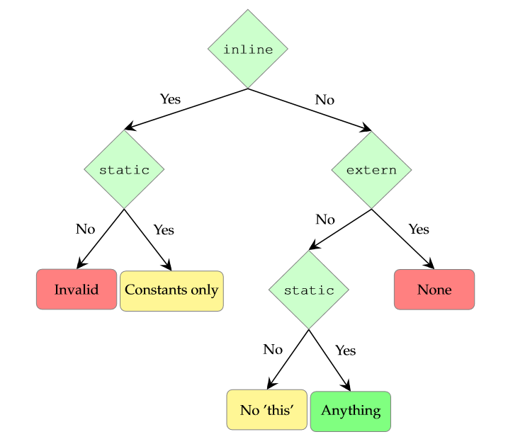

# 4.1.变量

我们在前面的章节中已经见过不少变量字段了，和大部分（不是所有）属性字段一样，变量字段用于存储一个值：

> We have already seen variable fields in several code examples of previous sections. Variable fields hold values, a characteristic which they share with most (but not all) properties:

```haxe
class Main {
    static var member:String = "bar";
    
    public static function main() { 
        trace(member);
        member = "foo";
        trace(member);
    }
}
```

我们可以从这段代码了解到变量具有：

> We can learn from this that a variable

1. 名称（此处为：`member`）
2. 类型（此处为：`String`）
3. 可能带有一个常量初始化值（此处为：`"bar"`）
4. 可能带有[访问修饰符（第4.4节）](/4.类字段/4.4.访问修饰符)（此处为：`static`）

> 1. has a name (here: member),
> 2. has a type (here: String),
> 3. may have a constant initialization (here: "bar") and
> 4. may have access modifiers (4.4) (here: static)

样例程序首先会输出 `menber` 的初始值，然后在输出新的值之前给它赋值 `"foo"`， 访问修饰符的效果由三种类型的类字段共享，将在之后的章节单独展开讨论。

> The example first prints the initialization value of member,then sets it to "foo" before printing its new value. The effect of access modifiers is shared by all three class field kinds and explained in a separate section.

需要注意，如果声明存在初始化值时显式的类型声明不是必须的，此时编译器会自行[推断（第 3.6 节）](/3.类型系统/3.6.类型推断)它的类型。

> It should be noted that the explicit type is not required if there is an initialization value. The compiler will [infer](https://haxe.org/manual/type-system-type-inference.html) it in this case.

不同情况下变量字段允许的初始化值：



