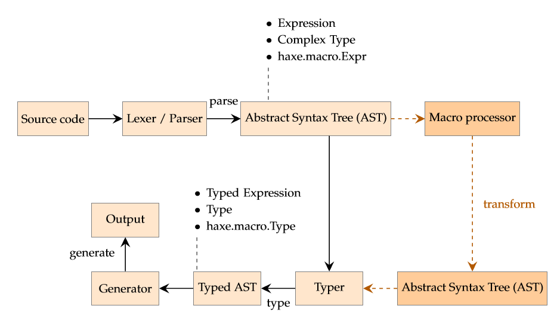

# 9.宏

宏毫无疑问是Haxe中最先进的功能。它们经常被认为是黑魔法，只有少数人能够精通，但其实它们没有什么魔法（当然也没有黑暗）。

> 定义：抽象语法树（AST）
> AST是解析Haxe代码到一个类型化的结构的结果。这个结构被通过在Haxe标准库的 haxe/macro/Expr.hx 定义的类型暴露给宏。

编译中宏的规则如下：

一个基本的宏是一个语法转换。它接受0或者多个表达式（第5章）并返回一个表达式。如果一个宏被调用，它实际上从它调用的位置插入代码。在这方面，它可以被跟一个预处理，如C++中的 #define对比，但是一个Haxe 宏并不是一个文本替换工具。

我们可以识别不同种类的宏，它们运行在特定的编译阶段：

**初始化宏**：这些被通过命令行提供，使用 --macro 编译器参数。它们在编译器参数被处理、类型器上下文被创建之后，但在任何类型化开始之前执行（查看初始化宏（第9.7节））。

**构建宏**：这些是为类、枚举和抽象类型定义，通过 @:build 或者 @:autoBuild 元数据（第6.9节）定义。在每次类型化时执行，在类型被设置之后（包括跟其它类型的关系，比如类的继承），但是在它的字段被类型化之前（查看类型构建（第9.5节））。

**表达式宏**：这些是普通的函数，在它们被类型化之后马上执行。